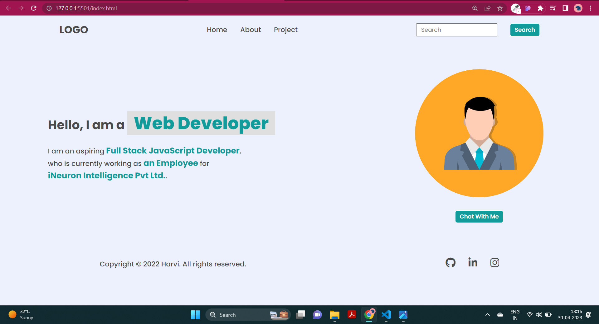

### Dom 1st Assignments

Task 1:
Add 'Hire me' name in the list and change contact name  to project.

Output image:

 
Code:

// change name contact to projects .
let project = document.querySelector("header nav ul li:nth-child(3)");

project.textContent = 'Projects';

task 2 :- add new name as a Hire me 
let hireme = document.createElement(`li`);

let anchortag = document.createElement(`a`);

anchortag.textContent = `Hire Me`;

anchortag.setAttribute(`href`, `#`);

hireme.appendChild(anchortag);

 let parent = document.querySelector("header nav ul");

 parent.appendChild(hireme)

Task 2:
Changing placeholder 

output image:

code:

let search = document.querySelector(".search-field input");

search.placeholder = "Search My Project";

Task 3 :
Adding Text
output image:

code :

let text = document.querySelectorAll(".hero-left-section p span");
text[1].innerText = "an Employee";
text[2].innerText = "iNeuron Intelligence Pvt Ltd.";

Task 4 :
Adding image

output image:

code :
let photo = document.querySelector(".hero-right-section img");
photo.src = "https://hiteshchoudhary.com/static/a8d73d1aac4c79e9bb689640e6090367/2eaab/person-image.jpg"

Task 5 :
Create button
output image:

code :

let value = document.querySelector(".hero-right-section-btns ");
let button2 = document.createElement("button");
button2.innerText = "Support Me";
value.appendChild(button2);

# DOM 2 Assignments 

task 1 : change heading background color

code:

let heading = document.querySelectorAll(".accordian h3");

heading.forEach((element)=>{
  element.style.backgroundColor = "#dadafe"
})

task 2 : change paragraph's background color 

code:

let paragraph = document.querySelectorAll(".accordian p");

paragraph.forEach((element)=>{
  element.style.backgroundColor = "pink"
});

output Images:  

task 3 : add skills section 

code :

let parent = document.querySelector(".accordian-wrapper");

let element = document.createElement("div");

element.className = "accordian";

let head = document.createElement("h3");

head.innerText = "Skills";

let para = document.createElement("p");

para.innerText = "I posses a very good command over the Full Stack Development technologies like MERN can be seen in my work over the GitHub";

para.style.display = "none";

element.appendChild(head);

element.appendChild(para);

parent.appendChild(element);

head.addEventListener('click', function(){
  if (para.style.display === 'none'){
    para.style.display = 'block';
  }
  else{
    para.style.display = 'none';
  }
});

output Images:  

# DOM 3  Assignments 

Task 1 :    Change placeholder text of readonly placeholder 

code:

let parent = document.querySelector(".mainLeftDetails");

let inputfiled = parent.querySelectorAll("input");

inputfiled[0].removeAttribute('readOnly');
inputfiled[0].setAttribute("placeholder","FSJS 2.0");

inputfiled[1].removeAttribute("readOnly","readOnly");
inputfiled[1].setAttribute("placeholder","fsjs@ineuron.ai");

let textarea = parent.querySelectorAll("textarea");

textarea[0].removeAttribute("readOnly","readOnly");
textarea[0].setAttribute("placeholder","Hello Web Developer");

output :  

Task 2 :  Change text into the placeholder 

code:

let rightsection = document.querySelector(".mainRight");

let input = rightsection.querySelectorAll("input");

let area = rightsection.querySelectorAll("textarea");

input[0].placeholder = "FSJS 2.0";
input[1].placeholder = "fsjs@ineuron.ai";
area[0].placeholder = "Welcome to the JS world"

output :  

